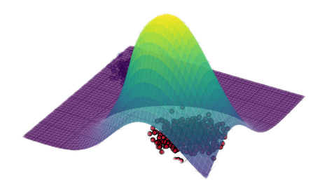
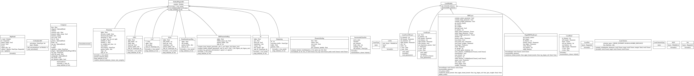
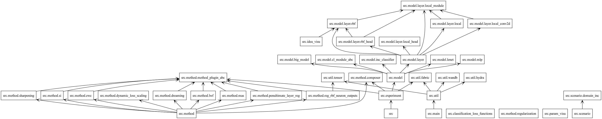

# Local Continual Learning
<p align="right"></p>

**Patryk Krukowski, Jan Miksa** @ *GMUM JU*

🚀 *Let's forget about catastrophic forgetting!* 🚀

<p align="center"></p>

***Work in progress... There may be bugs and features might be missing.***

## Features
- Hydra Configuration
- WANDB Logging
- Lightning Fabric
- Custom Plugin System for Methods
- Incremental Classifier
- Ability to use any torchvision model as pretrained backbone

| Method | Status | Custom Layers | Status | Model | Status | Scenario | Status | Dataset | Status |
| ------ | -- | ------ | -- | ------ | -- | ------ | -- | ------ | -- |
| Naive | ✅ | Local | ✅ | MLP | ✅ | CI | ✅ | MNIST | ✅ |
| LwF | ✅ | RBF | ✅ | LeNet | ✅ | DI | ✅ | ImageNet | ✅ |
| EWC | ✅ | SingleRBFHead | ✅ | Big Backbone | ✅ | TI | ✅ | CIFAR100 | ✅ |
| Sharpening | ✅ | MultiRBFHead | ✅ | DenseNet | ✅ | II | ✅ | TinyImageNet | ✅ |
| SI | ✅ | KAN | ❌ | | | Permuted | ⭕️ | SVHN | ✅ |
| MAS | ✅ | LocalHead | ⭕️ | | | | | CIFAR-10 | ✅ |
| RBFReg | ✅ | LocalConv2D | ⭕️ | | | | | FMNIST | ✅ |
| Dreaming | ✅ | IntervalActivation | ✅ |
| Dynamic Loss Scaling | ✅ |
| Interval Penalization | ✅ |

## Commands
**Setup**
```
conda create -n "lcl" python=3.9
pip install -r requirements.txt
cp example.env .env
edit .env
```

**Launching Experiments**
```
conda activate lcl
WANDB_MODE={offline/online} HYDRA_FULL_ERROR={0/1} python src/main.py --config-name config 
```

## Diagrams
<p align="center"></p>
<p align="center"></p>

## Acknowledgements
- Project Structure based on [template](https://github.com/sobieskibj/templates/tree/master) by Bartłomiej Sobieski
- PyTorchRBFLayer [repo](https://github.com/rssalessio/PytorchRBFLayer) by Alessio Russo
